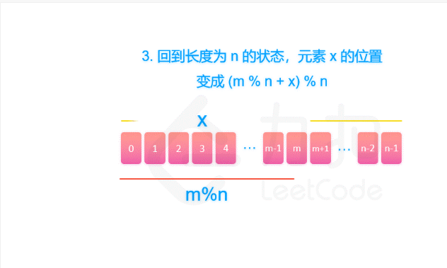

[剑指 Offer 62. 圆圈中最后剩下的数字](https://leetcode-cn.com/problems/yuan-quan-zhong-zui-hou-sheng-xia-de-shu-zi-lcof/)
---
### 递归
* 每一次删除都是删除新序列的第m%n的元素
* 删除后我们会得到一个(m%n)+1开头,(m%n)-1结尾长度为n-1的序列
* f函数返回的是一个序列中最后剩余数字所在的位置x
* 根据这个数字在新序列的位置我们可以知道这个数字在旧序列的位置，即(m%n+x)%n

```java
// 获取长度为n的序列，不停删除第m个数后剩下的那个数字在当前序列的位置序号
    public class Solution {
        public int lastRemaining(int n, int m) {
            return f(n, m);
        }
    
        // 获取长度为n的序列，不停删除第m个数后剩下的那个数字在当前序列的位置序号
        public int f(int n, int m) {
            // 最后只有一个包含一个数字的序列，所在位置肯定为0
            if (n == 1) {
                return 0;
            }
            int x = f(n-1, m);
            return (m%n+x)%n;
        }
    
    }
```